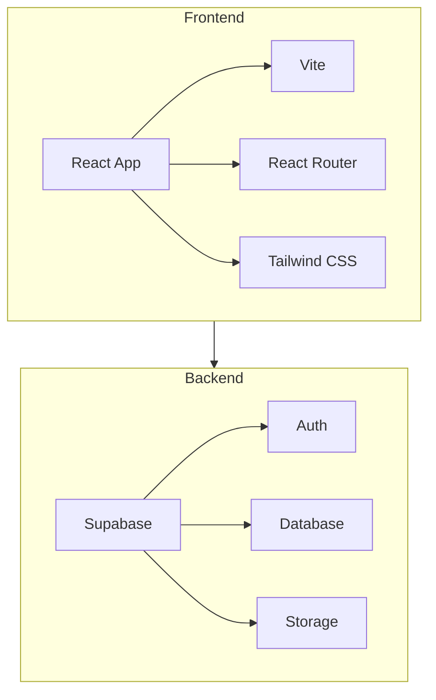
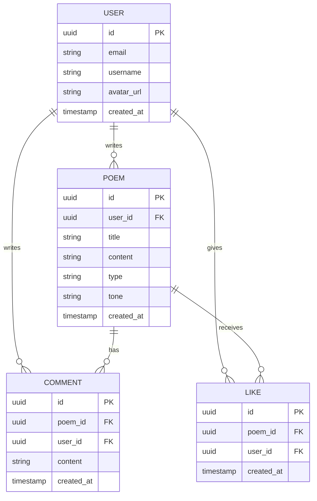

## 1. Architecture Design


## 2. Technology Description
- 前端: React@18 + tailwindcss@3 + vite
- 初始化工具: create-vite
- 后端: Supabase
- 数据库: Supabase (PostgreSQL)

## 3. Route Definitions
| Route | Purpose |
|-------|---------|
| / | 首页 |
| /create | 创作页面 |
| /poem/:id | 诗词详情页 |
| /profile | 个人中心 |

## 4. API Definitions
使用 Supabase 客户端 SDK 进行数据操作。

## 5. Data Model
### 5.1 Data Model Definition


### 5.2 Data Definition Language
```sql
-- 用户表
create table users (
  id uuid references auth.users not null primary key,
  email text unique,
  username text,
  avatar_url text,
  created_at timestamp default now()
);

-- 诗词表
create table poems (
  id uuid default gen_random_uuid() primary key,
  user_id uuid references auth.users not null,
  title text not null,
  content text not null,
  type text,
  tone text,
  created_at timestamp default now()
);

-- 评论表
create table comments (
  id uuid default gen_random_uuid() primary key,
  poem_id uuid references poems not null,
  user_id uuid references auth.users not null,
  content text not null,
  created_at timestamp default now()
);

-- 点赞表
create table likes (
  id uuid default gen_random_uuid() primary key,
  poem_id uuid references poems not null,
  user_id uuid references auth.users not null,
  created_at timestamp default now(),
  unique(poem_id, user_id)
);

-- 权限设置
alter table users enable row level security;
alter table poems enable row level security;
alter table comments enable row level security;
alter table likes enable row level security;

-- 用户表策略
create policy "Public profiles are viewable by everyone." on users
  for select using (true);
create policy "Users can insert their own profile." on users
  for insert with check (auth.uid() = id);
create policy "Users can update their own profile." on users
  for update using (auth.uid() = id);

-- 诗词表策略
create policy "Poems are viewable by everyone." on poems
  for select using (true);
create policy "Users can insert their own poems." on poems
  for insert with check (auth.uid() = user_id);
create policy "Users can update their own poems." on poems
  for update using (auth.uid() = user_id);
create policy "Users can delete their own poems." on poems
  for delete using (auth.uid() = user_id);

-- 评论表策略
create policy "Comments are viewable by everyone." on comments
  for select using (true);
create policy "Users can insert their own comments." on comments
  for insert with check (auth.uid() = user_id);
create policy "Users can update their own comments." on comments
  for update using (auth.uid() = user_id);
create policy "Users can delete their own comments." on comments
  for delete using (auth.uid() = user_id);

-- 点赞表策略
create policy "Likes are viewable by everyone." on likes
  for select using (true);
create policy "Users can insert their own likes." on likes
  for insert with check (auth.uid() = user_id);
create policy "Users can delete their own likes." on likes
  for delete using (auth.uid() = user_id);
```

