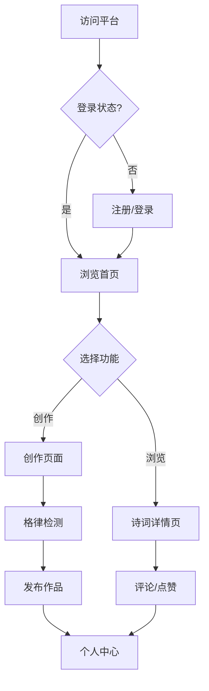

## 1. Product Overview
诗词创作平台「平仄间」，为诗词爱好者提供创作、交流、学习的空间。
- 主要目标：帮助用户创作符合格律的诗词，提供学习资源和社区交流
- 目标用户：诗词爱好者、学生、传统文化研究者

## 2. Core Features

### 2.1 User Roles
| Role | Registration Method | Core Permissions |
|------|---------------------|------------------|
| 普通用户 | 邮箱/手机号注册 | 浏览诗词、创作诗词、评论、点赞 |
| 管理员 | 后台邀请 | 管理内容、审核诗词 |

### 2.2 Feature Module
1. **首页**：诗词展示、热门推荐、导航栏
2. **创作页面**：格律检测、诗词编辑器、示例参考
3. **诗词详情页**：诗词展示、作者信息、评论区
4. **个人中心**：我的作品、收藏、设置

### 2.3 Page Details
| Page Name | Module Name | Feature description |
|-----------|-------------|---------------------|
| 首页 | 轮播展示 | 展示精选诗词作品 |
| 创作页面 | 格律检测 | 实时检测平仄押韵 |
| 诗词详情页 | 评论系统 | 用户可发表评论和点赞 |
| 个人中心 | 作品管理 | 查看和管理自己的作品 |

## 3. Core Process
用户访问平台 → 浏览诗词或登录 → 进入创作页面 → 编辑诗词 → 格律检测 → 发布作品 → 社区互动

## 4. User Interface Design
### 4.1 Design Style
- 主色调：墨色（#2d2d2d）、米黄色（#f5f0e6）、朱砂红（#c84036）
- 按钮风格：圆角矩形，简约雅致
- 字体：宋体/楷体为主，字号层次分明
- 布局风格：卡片式布局，留白充足
- 图标风格：古风简约线条图标

### 4.2 Page Design Overview
| Page Name | Module Name | UI Elements |
|-----------|-------------|-------------|
| 首页 | 轮播展示 | 米黄背景，卡片式诗词展示，淡入动画 |
| 创作页面 | 编辑器 | 左侧编辑区，右侧格律检测区，实时反馈 |
| 诗词详情页 | 诗词展示 | 竖排/横排切换，作者信息卡片，评论区 |

### 4.3 Responsiveness
桌面端优先，移动端适配，触控优化，保持古风美学在不同设备上的一致性。

